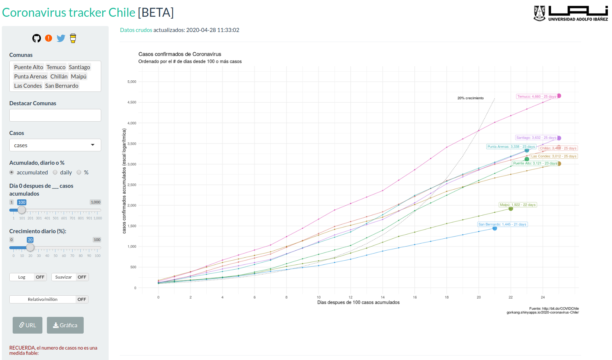

# Coronavirus tracker Chile

Repositorio con codigo R para una aplicacion Shiny que permite comparar de manera interactiva los casos de Coronavirus en Chile por comuna usando datos del minsal.

Por favor, consulta siempre fuentes oficiales (e.g. [WHO](https://www.who.int/emergencies/diseases/novel-coronavirus-2019)), y se prudente su usas esta u otra información para crear modelos predictivos.

## Fuente de datos

* COVID-19 Chile: https://docs.google.com/spreadsheets/d/1mLx2L8nMaRZu0Sy4lyFniDewl6jDcgnxB_d0lHG-boc/edit?ts=5ea7297f#gid=1828101674

## Codigo inicial, ideas, inspiracion de:

* [Coronavirus Tracker](https://gorkang.shinyapps.io/2020-corona/)
* [\@JonMinton](https://twitter.com/JonMinton): [idea y codigo para el grafico inicial](https://github.com/JonMinton/COVID-19)
* [\@christoph_sax](https://twitter.com/JonMinton): [preparacion de datos inicial](https://gist.github.com/christophsax/dec0a57bcbc9d7517b852dd44eb8b20b)
* [\@nicebread303](https://twitter.com/nicebread303): idea para linea de tendencia.
* [\@rubenivangaalen](https://twitter.com/rubenivangaalen): idea para \% diferencia
* [\@jburnmurdoch](https://twitter.com/jburnmurdoch) y [\@sdbernard](https://twitter.com/sdbernard): idea para destacar paises/comunas. [Ver su coronavirus tracker](https://www.ft.com/coronavirus-latest)

## Otros trackers para datos Chilenos:

* https://coronavirus.mat.uc.cl/
